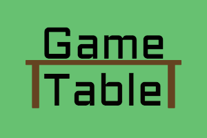

# GameTable

GameTable is a project created and developed by me (Thomas Spencer) to help fufil a need in my personal life. I organize and facilitate various tabletop game nights across the GTA, and have been trouble coordinating game facilitators to meet the increasing demand of customers. Enter...

    

* Ruby version

* System dependencies

* Configuration

* Database creation

* Database initialization

* How to run the test suite

* Services (job queues, cache servers, search engines, etc.)

* Deployment instructions

* ...
